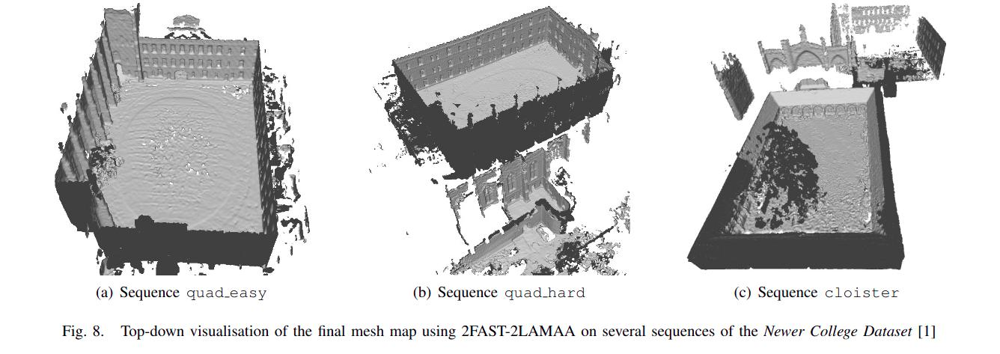
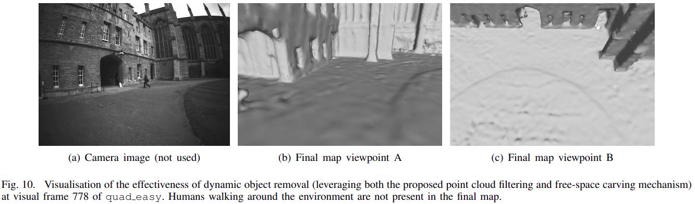

# 2Fast-2Lamaa

This repository contains the code of a lidar-inertial localisation and mapping framework named 2Fast-2Lamaa.
It is built upon the lidar-inertial undistortion work presented at IROS 2024 (more details [here](https://uts-ri.github.io/lidar_inertial_motion_correction/)).
__If you are looking to use the undistortion-related code from our IROS publication, please refer to the [Undistortion](#undistortion-iros-2024) section.__

2Fast-2Lamaa stands for Fast Field-based Agent-Subtracted Tightly-coupled Lidar Localisation And Mapping with Accelerometer and Angular-rate.
In other words, it performs localisation and mapping in dynamic environments (_agent-substracted_) with a lidar and an IMU (_accelerometer and angular-rate_) using distance a Gaussian-Process-based distance field.
The method integrates the [Screen Poisson Surface Reconstruction](https://github.com/mkazhdan/PoissonRecon) to directly output triangle mesh of the environment.
The technical details of the overall framework can be found in our [2Fast-2Lamaa technical paper](https://arxiv.org/abs/2410.05433).
Note that this package is available for ROS1 and ROS2.
__The main branch is the ROS2 version__, the ROS1 version is available in the ROS1 branch.






Corresponding contributor: le.gentil.cedric@gmail.com

## Disclaimer

This code is provided as it is. It has not been optimised for robustness, nor been tested with other datasets than the ones presented in the technical report.
We open-sourced this work for the benefit of the robotics community and we are open to suggestions/collaborations to improve this pipeline.

## Citing

If you are using this framework or part of it please cite our technical report and the corresponding peer-reviewed publications as shown at the bottom of this page


## Installation

A Dockerfile will be provided in the future. Meanwhile, you can install and run the package as follows:

### Dependencies

The following dependencies are required to build the package:
- ROS2
- Ceres
- Eigen

Please refer to the [ROS2 installation guide with Ubuntu 24.04](https://docs.ros.org/en/jazzy/Installation/Ubuntu-Install-Debs.html) for the installation of ROS2.
The other dependencies can be installed using the following command:
```bash
sudo apt install libceres-dev libeigen3-dev
```
(if the default Ceres version is too old, you need to install Ceres 2.2 from source)

### Building

To build the package, clone the repository in your workspace and build it using colcon:
```bash
cd /path/to/your/workspace/src
git clone https://github.com/UTS-RI/2fast2lamaa.git
cd ..
colcon build --packages-select ffastllamaa
source install/setup.bash
```

### Running

To run the package, you need to have a rosbag with the following topics:
- /imu
- /lidar

You need to know the extrinsic calibration between the lidar and the IMU (the data should also be synchronised ideally)
Incorrect knowledge of the extrinsic calibration will result in poor localisation and mapping performance.

Then you can run the package using the following command:
```bash
ros2 launch ffastllamaa os0_lidar_odometry.launch.py
```

__Please note that the visualisation creates some additional computation and block some mutexes. For optimal performance, deactivate the various visualisations.__


## Undistortion (IROS 2024)

The undistortion code is available in the `lidar_odometry` node (and requires the `scan_maker` and `lidar_feature_detection` nodes).
We provide a launch file to run the undistortion without the registration and mapping components of 2Fast-2Lamaa.
To run the undistortion code, you can use the following command:
```bash
ros2 launch ffastllamaa os0_lidar_undistortion.launch.py
```

__Please note that the dynamic object detection in the IROS paper is not included in this repository.__
It is based on our previous work on dynamic object detection [Dynamic Object Detection in Range data using Spatiotemporal Normals](https://uts-ri.github.io/dynamic_object_detection/).


## Publications

2Fast-2Lamaa
```bibtex
@misc{legentil20242fast2lamaa,
  title={2FAST-2LAMAA: A Lidar-Inertial Localisation and Mapping Framework for Non-Static Environments}, 
  author={Le Gentil, Cedric and Falque, Raphael and Vidal-Calleja, Teresa},
  year={2024},
  eprint={2410.05433},
  archivePrefix={arXiv},
  primaryClass={cs.RO},
  url={https://arxiv.org/abs/2410.05433}, 
}
```

Imu preintegration: __Continuous latent state preintegration for inertial-aided systems__ (2023)
```bibtex
@article{legentil2023continuous,
  author = {Le Gentil, Cedric and Vidal-Calleja, Teresa},
  title ={Continuous latent state preintegration for inertial-aided systems},
  journal = {The International Journal of Robotics Research},
  volume = {42},
  number = {10},
  pages = {874-900},
  year = {2023},
  doi = {10.1177/02783649231199537},
  URL = { https://doi.org/10.1177/02783649231199537 },
  eprint = { https://doi.org/10.1177/02783649231199537 }
}
```

Distance field: __Accurate Gaussian-Process-Based Distance Fields With Applications to Echolocation and Mapping__ (2024)
```bibtex
@article{legentil2024accurate,
  author={Le Gentil, Cedric and Ouabi, Othmane-Latif and Wu, Lan and Pradalier, Cedric and Vidal-Calleja, Teresa},
  journal={IEEE Robotics and Automation Letters}, 
  title={Accurate Gaussian-Process-Based Distance Fields With Applications to Echolocation and Mapping}, 
  year={2024},
  volume={9},
  number={2},
  pages={1365-1372},
  keywords={Kernel;Surface treatment;Noise measurement;Uncertainty;Three-dimensional displays;Surface reconstruction;Euclidean distance;Localization;mapping},
  doi={10.1109/LRA.2023.3346759}
}
```


Undistortion: __Real-Time Truly-Coupled Lidar-Inertial Motion Correction and Spatiotemporal Dynamic Object Detection__ (2024)
```bibtex
@inproceedings{legentil2024lidar,
  author={Le Gentil, Cedric and Falque, Raphael and Vidal-Calleja, Teresa},
  booktitle={2024 IEEE/RSJ International Conference on Intelligent Robots and Systems (IROS)},
  title={Real-Time Truly-Coupled Lidar-Inertial Motion Correction and Spatiotemporal Dynamic Object Detection},
  year={2024},
  volume={},
  number={},
  pages={},
  doi={TBD}
}
```

